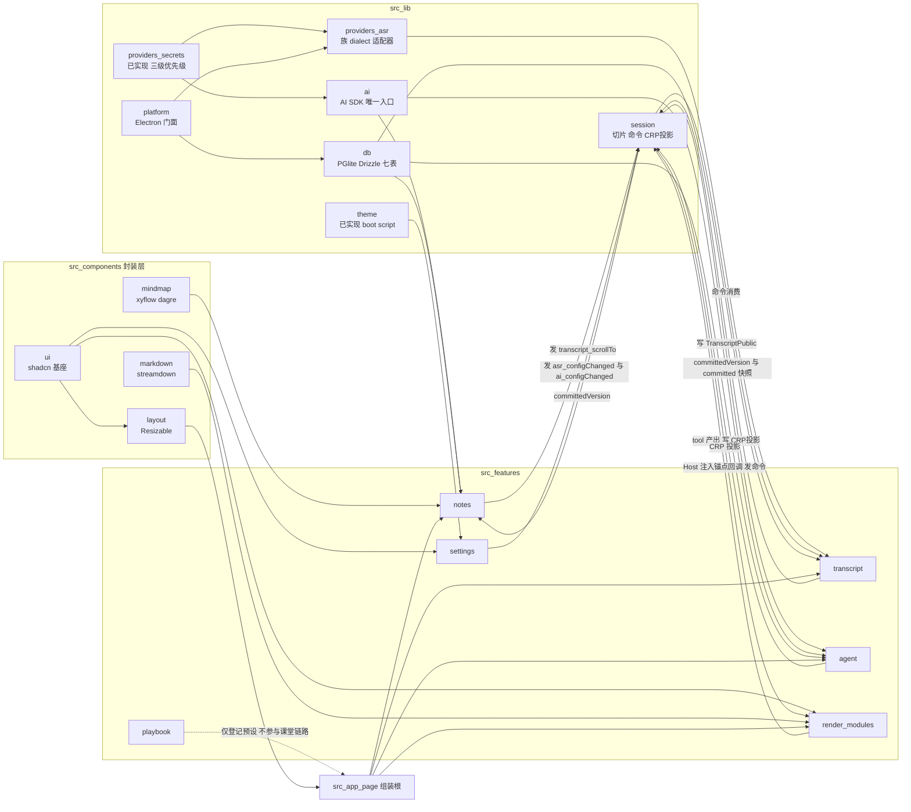

# Classolo 工程 PRD

> Created: 2026-08-30
> Status: approved（供 GitHub Issue 拆解；实现方案以 ADR/spec 为准，本文管需求与排期）
> Demo 停点：浏览器 localhost:4070 跑通一节课；不要求 Electron exe

**本文定位**：把 `docs/plans/roadmap-p0-p1-p2.md` 的清单变成**可拆 issue 的需求单**。
实现细节（接口签名、目录、库用法、频道名）一律以 `docs/adr/`、`docs/specs/`、`docs/designs/` 为准，本文不重复、不改口。
上下文来源：[`_prd-context-pack.md`](./_prd-context-pack.md)。

---

## 1. 需求阐明

### 1.1 课堂用户故事

**主角**：高校学生，笔记本电脑带进教室，课前打开 Classolo。

1. **课前（10 秒）**：打开 `localhost:4070`（生态期为 `classolo.1037solo.com`，桌面期为 exe）。工作台已是四区形态：左导航（可收起）、文稿区、笔记区，文稿区与笔记区下方各有一个渲染区。上一次拖过的分屏比例还在。主题跟随系统。首次使用时，AI/ASR 配置来自本机 `.env` 或设置页填过的 key。
2. **点开始录音**：麦克风开始采集，文稿区逐字滚出老师说的话——正在说的那句是灰的（partial），说完落定成带时间戳的一段（final）。学生不需要动手，只需要听。
3. **上课中（笔记区）**：AI 每隔几秒把新落定的文稿整理成大纲，笔记区渲染成思维导图。新讲到的分支长出来带进入动画，**已经画好的节点不会跳位、不会整张重排**。学生想回头看某个概念，点导图节点，文稿区滚到那句话并高亮。
4. **上课中（渲染区）**：老师提到「二尖瓣的解剖位置」，学生没听懂——**静默 Agent** 自己判断这里需要一张真实解剖图，检索后把图片卡片投到渲染区；老师某段讲得太快，Agent 自动补一段富文本讲解。学生全程没打字。
5. **有疑问时**：打开对话 Agent 问「刚才讲的适应证有哪几条」。Agent 检索**本节课真实文稿**（不是幻觉），带思考过程流式回答，并可引用某句话回跳文稿。
6. **下课**：点结束录音。P0 到此为止（保存进历史、生成知识清单、复习推送都是 P1）。

**反面场景（明确不服务）**：手机上课记笔记；多设备同时上一节课；把课件传上云端共享。

### 1.2 P0 Demo 验收（本轮唯一闸门）

验收面 = **浏览器 `localhost:4070`**。以下五条全绿即通过，**不要求打出 Electron exe**：

| # | 验收项 | 判定口径 |
|---|---|---|
| D1 | **45 分钟课不丢字** | 连续录音 ≥45 分钟，中途人为断网 1 次可自动重连；结束后文稿区可完整回看全部 final 段，无缺段、无重复段、无崩溃。判定以**文稿区可回看**为准，不以落库为准（落库是 P0 工程目标，见 1.3）。 |
| D2 | **导图随讲随更不闪烁** | 大纲每次增量更新时，已存在节点保持原坐标不跳位；只有新节点做进入动画；无整图重排、无白屏闪帧。 |
| D3 | **静默 Agent 能出图或补充讲解** | 无用户输入的前提下，Agent 按语义段节流自主触发，至少能稳定产出 `image` **或** `rich-text` 之一的渲染卡片（建议两者都通）；卡片落在正确的 `target` 渲染区。 |
| D4 | **可对话并检索真实文稿** | 对话 Agent 能回答只有本节课文稿里才有的信息，答案可追溯到具体转写段；流式输出 + reasoning 展示可见。 |
| D5 | **不要求 exe** | 上述四条在浏览器完成即通过。Electron 打包不进本轮闸门。 |

**Demo 期依赖前提**：一家 `realtime-ws` dialect（默认 `stepfun`）+ `.env` 里的 `ASR_*` / `AI_*` key 即可跑通；设置页表单不是 Demo 前提。

### 1.3 P0 全量验收（Demo 之后仍要收口，不是 Demo 闸门）

路线图 P0 验收原文的完整口径，与 Demo 分成两档，避免「没 exe 就不算 P0」的误读：

- 三家 P0 ASR 适配器齐套：`realtime-ws`（上课默认）+ `transcriptions-rest`（UI 标「准实时」）+ `local-engine`（sherpa-onnx，Electron 阶段）。
- 七张 `cs_` 表落地 + 转写批量写入 + **45–90 分钟写入压测**（口径见 `docs/specs/local-schema.md` §4.6）。
- 设置页 v1：AI / ASR 协议族 + 用户 key 覆盖 + 热词自定义 + 主题强制。
- CRP 五模块齐套：`image` / `rich-text` / `ai-ask` / `gen-ui` / `agent-status`。
- Electron 打包链路：静态导出 + `app://` + electron-builder NSIS + updater。
- 除用户自配的 AI / ASR API 外无网络依赖。

### 1.4 P0 上课关键路径

**关键路径的定义**：从「点开始录音」到「Demo 五条全绿」这条最短链上的需求。

- **在关键路径上**：shadcn 基座 → session 三通道 → 四区壳 → 录音采集 + 一家 `realtime-ws` + env key → 文稿流与公开切片 → 增量大纲 + xyflow/dagre 稳定 diff → CRP registry/Host + 1–2 个模块 → 静默 Agent + 对话 Agent + 文稿检索。
- **是 P0 但不在关键路径**：`transcriptions-rest` 适配器、`local-engine` 适配器、七表与压测、设置页全部表单、热词自定义 UI、`ai-ask` / `gen-ui` / `agent-status` 模块、Playbook 演示补齐、分屏比例持久化、点节点回跳、Electron 全链路。
- **理由**：ASR 是接口层已拍板的可插拔面（ADR-0004），多接一家不改变课堂主链；密钥优先级是「用户覆盖 > env > 空」（ADR-0013），Demo 走 env 分支完全合法，设置页只是补上第一优先级的写入口。

### 1.5 P1 —— 保存、复习站与通用 Agent

**做什么**：录音会话结束后像一次 AI 对话那样存进左侧导航历史；导航补齐完整形态（新录音 / 新对话 / 资源库 / 复习站 / 测试站 + 底部设置）；「新对话」作为复习定位的 Agent 入口，工具含历史课堂检索、素材库教材检索、skills（借鉴 pi 的上下文工程实践，**不引包**）；录音结束自动生成知识清单与知识卡片入资源库；复习站按遗忘曲线驱动进度与掌握度推送（SRS 候选 ts-fsrs，届时走选型流程）+ 本地系统通知；后台定时出题 Agent（`powerSaveBlocker` + 通知）；`question-schema.md` 落地；腾讯 `16k_zh_medical` 私有 WS 适配器（`cloud-private-ws` 族）；session 公开切片按 zustand context 配方升级以支持「历史课 + 新录音」并存。

**明确不做**：分享某一课的 URL（会话仍是客户端状态，要做须新 ADR）；多设备同步；向量检索（P0/P1 检索用 `ILIKE`）；提前建 P1 预留表（`local-schema.md` §6 只是命名预留，不提前建）。

### 1.6 P2 —— 错题定位与押题

**做什么**：错题反向定位到知识点并自动生成加固题；章节/知识点掌握度画像与可视化（recharts，生态沿用）；考期押题（设置期中/期末时间，按月产出押题卷，考前密集）；素材库增强（教材上传入库供 Agent 检索）。

**明确不做**：把学习数据外发做画像；跨用户排行/社交；在 P2 之前提前动 P2 数据结构。

### 1.7 生态接入期 —— 最晚，独立于 P 级别

**做什么**：`StorageProvider` 换 Supabase 实现（表已带 `cs_` 前缀）+ 本地数据上云脚本 + `user_id` 回填 + RLS（`local-schema.md` §7）；Auth 换 `account.1037solo.com` SSO（`client_id=classolo`）；Mail 用生态共享推送密钥；宝塔 nginx 反代 4070（`classolo.1037solo.com.conf`）；会员/订阅对齐生态统一定价。

**明确不做**：把云同步做成第四条全局 bus；把多设备冲突合并（CRDT 等）塞进 session 层——未选型，到期单独立 ADR；在此之前让 P0/P1 依赖任何生态服务。

### 1.8 非目标（全阶段）

1. **手机端**。电脑优先、平板其次，`html { min-width: 768px }` 是硬下限（ADR-0001）。
2. **EdgeOne / Vercel 等云部署专属配置**。`next.config.ts` 保持 `output:'export'` 三件套；Web 版只走生态期宝塔反代（ADR-0002）。
3. **统一登录 / SSO / Supabase 进 P0 或 Demo**。P0 用本地匿名用户常量 `00000000-0000-0000-0000-000000000001`，不建 `cs_user`。
4. **把密钥写入 PGlite**。API key 只走 `src/lib/providers/secrets/`；`cs_provider_profile` 只存 `credential_ref` + `has_credential`；浏览器期用户覆盖不入库，Electron 期进 `safeStorage`。
5. 附带的红线（review 用）：不开放 `[id]` 动态路由 / `middleware.ts` / `pages/` / `src/app/api/` / Server Action；不引入通用 event bus 与第二个状态库；不做 `google-bidi` ASR；Gen UI 不执行任意 JSX；不用字符串模型 ID；Loop PR 一律打向 `dev`。

---

## 2. 模块与依赖

节点 = `src/features/*` 与 `src/lib/*`（含 `src/components/*` 的封装层）。依赖方向恒为 **`app → features → lib`**；**features 之间零横向 import**，跨域只经 `src/lib/session/`（ADR-0017）。

### 2.1 依赖图

### 2.2 硬依赖（必须先完成前者）

| 后者 | 硬依赖前者 | 为什么不能并行 |
|---|---|---|
| 一切 UI 表单/卡片 | `components/ui`（shadcn 基座 + `cn`） | 目录当前为空，没有基座就会各写各的按钮，违反 ADR-0003 |
| 任意跨域读写 | `src/lib/session` 三通道骨架 | 当前只有 `export {}`；先写业务必然出现横向 import |
| CRP Host 与模块 | CRP 投影 store + `registry.ts` + manifest 约定 | 模块是注册进来的，注册面不定就得返工 |
| 笔记整理器 / 静默 Agent 触发 | `TranscriptPublic.committedVersion` 已被 transcript 写入 | 触发源就是这个版本号，禁止读 partial、禁止按句触发 |
| 静默 Agent 出卡片 | CRP Host + 至少一个模块 manifest（tool 由 manifest 派生） | 「tool 即渲染」，没有 manifest 就没有 tool |
| 对话检索工具 | 文稿 final 段已进公开切片（或已落库） | 检索的是真实文稿，不是模型记忆 |
| 导图增量 diff | xyflow + dagre 封装层可用 | 布局器是 diff 的输入 |
| 用户 key 生效 | `lib/ai` / ASR 适配器已改为经 `resolveSecret` 取密钥 | 现状 `lib/ai` 未接 secrets，设置页填了也不生效 |
| 转写批量落盘 / 压测 | 七表 schema + Repository | 无表可写 |
| `local-engine` ASR | Electron main + `lib/platform` 门面 | sherpa-onnx 在 main 进程，feature 永不碰 `window` |
| Electron 全链路 | electron / electron-builder / electron-updater **依赖立项通过** | AI 无权单独新增生产依赖 |

### 2.3 可并行（互不阻塞，可同时开 Loop）

- ASR 三族适配器彼此并行（同一 `ASRProvider` 接口，`realtime-ws` 先行）。
- CRP 五个模块彼此并行（协议禁止模块互 import，天然隔离）。
- 设置页四块表单（AI / ASR / 热词 / 主题）彼此并行，且整块与课堂主链并行——Demo 走 env 分支。
- 七表 schema + 压测 与 课堂 UI 主链并行（写入是拥有者 feature 侧的追加调用）。
- Playbook 演示补齐 与 全部课堂需求并行，且**不挡任何验收**。
- ESLint 边界规则 与 业务并行（越早越省返工）。
- Electron parent 内部：`app://` 协议壳 / DB 迁 `userData` / NSIS 打包 可分头做，但都在依赖立项之后。

### 2.4 三条通道的使用纪律（拆 issue 时必须写进验收）

1. **转写 → session 公开切片 → 笔记 / Agent**：partial 只进 transcript 私有 store；只有 `onFinal`（或语义段聚合）才 append 进 `TranscriptPublic.committed` 并 `committedVersion++`。notes 与 agent **只订版本号**再 debounce / 节流，**禁止**任何外域 React 订阅 partial 或订阅 `committed` 全数组。
2. **CRP 只经投影**：Agent tool 执行与 `source: 'system'` 通过 `writes/render` 做 `upsert` / `revoke`；Host 按 `target` + `module` 分发，校验失败渲染错误卡片而不是崩整个渲染区；模块自身**不 import 命令总线**，锚点点击由 Host 注入回调。
3. **设置只发 `*.configChanged`**：settings 写自己的 `SettingsPublic`（只放 `*Version` / `*Ready`，**绝不放 key**），并 publish `asr.configChanged` / `ai.configChanged`。录音中不做 ASR 热切（P0 提示「下次录音生效」，热切留 P1）。
4. **回跳只走命令**：`transcript.scrollTo` / `transcript.highlight` 由 notes / Host / agent publish，**仅** transcript 消费。新增命令 = 改封闭联合类型 + 改通信矩阵 + 改 ADR-0017，禁止发明未登记字符串。
5. **不属于本层的东西**：分屏比例（走 `components/layout` + localStorage）、xyflow 像素坐标、密钥、流式 token、Electron IPC（走 `lib/platform`）。

---

## 3. 排期（按 Loop 序号，不用日历周）

**Loop 定义**：一个可独立完成、独立开 PR、独立合回 `dev` 的 sub-issue = 1 Loop。分支从 `dev` 拉、PR 打回 `dev`、CI（lint + `tsc --noEmit`）必须绿。

**P0 总量：40 Loop**（35 个 loop-ready + 5 个 Electron 不 loop-ready）。其中 **Loop 1–20 是 Demo 关键路径**，跑完即可停下做 Demo 验收。

### 3.1 Parent 概览

| # | Parent | Loop 区间 | Sub 数 | 性质 |
|---|---|---|---|---|
| 1 | Infra 地基（shadcn / 七表 / session 三通道） | 1–3, 30–31 | 5 | 3 个在关键路径 |
| 2 | Workbench 四区 | 4–5, 21 | 3 | 2 个在关键路径 |
| 3 | Transcript 录音转写 | 6–9, 28, 33 | 6 | 4 个在关键路径 |
| 4 | Notes 导图 | 11–13, 22 | 4 | 3 个在关键路径 |
| 5 | Render CRP 模块 | 14–16, 23–24 | 5 | 3 个在关键路径 |
| 6 | Agent 静默 + 对话 | 10, 17–20, 32 | 6 | 5 个在关键路径 |
| 7 | Settings 密钥 / 热词 / 主题 | 25–27, 29 | 4 | 0（Demo 走 env） |
| 8 | Playbook 演示补齐 | 34–35 | 2 | 0（不挡任何验收） |
| 9 | Electron | 36–40 | 5 | 0，**不 loop-ready，默认 Loop 不捡** |

### 3.2 关键路径（Loop 1–20，Demo 必需）

按依赖排序，同段内可并行。

| Loop | ID | 交付 |
|---|---|---|
| 1 | P0-INF-01 | shadcn 基座 + `cn`，课堂要用到的基础组件集就位 |
| 2 | P0-INF-02 | session 公开切片 + writes 白名单 + ESLint 边界规则 |
| 3 | P0-INF-03 | 命令总线（P0 封闭联合）+ CRP 投影 store |
| 4 | P0-WB-01 | 四区嵌套 Resizable 壳，导航可收起 |
| 5 | P0-WB-03 | 组装根挂载四区与两个渲染区挂载点 |
| 6 | P0-T-01 | 录音控制 + 16k PCM 采集管线 |
| 7 | P0-T-02 | `realtime-ws` 适配器（默认 dialect），env key 生效 |
| 8 | P0-T-03 | 文稿流 UI + 写 `TranscriptPublic` + 消费命令 |
| 9 | P0-T-04 | 断线重连 + 45 分钟长会话不丢字（**D1**） |
| 10 | P0-A-01 | `lib/ai` 接 `resolveSecret`，provider 实例化纪律 |
| 11 | P0-N-01 | 增量大纲整理器（流式结构化）+ 写 `NotesPublic` |
| 12 | P0-N-02 | xyflow + dagre 封装与自定义节点外观 |
| 13 | P0-N-03 | 稳定 id 树 diff、坐标保留、进入动画（**D2**） |
| 14 | P0-R-01 | CRP registry + manifest 校验约定 + Host 分发 |
| 15 | P0-R-02 | `image` 模块 |
| 16 | P0-R-03 | `rich-text` 模块 + markdown 渲染封装 |
| 17 | P0-A-02 | 静默 Agent 薄状态机（订版本号 + 语义段节流） |
| 18 | P0-A-03 | 静默 Agent tool → CRP 投递（**D3**） |
| 19 | P0-A-04 | 对话 Agent 流式 + reasoning 展示 + 对话面板 |
| 20 | P0-A-05 | 文稿检索工具（**D4**） |

> **Demo 停点在 Loop 20。** 此处冻结、跑 D1–D5、录 Demo。

### 3.3 P0 剩余（Loop 21–35，loop-ready，可延后但仍属 P0）

| Loop | ID | 交付 | 可延后的理由 |
|---|---|---|---|
| 21 | P0-WB-02 | 分屏比例 localStorage 持久化 + 平板断点/最小宽度降级 | 体验项，不影响五条验收 |
| 22 | P0-N-04 | 点击导图节点回跳文稿 | 命令通道已在 Loop 3 就位，补消费即可 |
| 23 | P0-R-04 | `agent-status` + `ai-ask` 模块 | Demo 只需 1–2 个模块 |
| 24 | P0-R-05 | `gen-ui` 受控 DSL + 白名单组件集 | 风险最高的模块，不该压在 Demo 上 |
| 25 | P0-S-01 | 设置页壳 + AI 协议族表单 | Demo 走 env |
| 26 | P0-S-02 | ASR 族 / dialect 配置表单 | 同上 |
| 27 | P0-S-03 | 密钥用户覆盖的存储与注入（不进 PGlite） | 补上优先级第一档 |
| 28 | P0-T-05 | 预置学科热词包机制 + 注入适配器 | 提升识别质量，非通断项 |
| 29 | P0-S-04 | 热词自定义 UI + 主题强制切换 UI | 依赖 Loop 28 的机制 |
| 30 | P0-INF-04 | 七张 `cs_` 表 schema + Repository + 匿名 `user_id` | 见下方说明 |
| 31 | P0-INF-05 | 转写 ring buffer 批量落盘 + 45–90 分钟写入压测 | P0 工程目标，非 Demo 闸门 |
| 32 | P0-A-06 | `ai.configChanged` 消费 + 失败/限流兜底 + 对话终态落库 | 依赖 Loop 25/30 |
| 33 | P0-T-06 | `transcriptions-rest` 适配器（UI 标「准实时」） | 第二家 ASR，非关键路径 |
| 34 | P0-PB-01 | Playbook registry 状态流转 + 挂真实预设实例 | 完全不挡验收 |
| 35 | P0-PB-02 | CRP 模块样例页 + `_dev/` 调试页（production `notFound()`） | 同上 |

> **关于 Loop 30–31 的位置**：Demo 判定 D1「不丢字」以**文稿区可完整回看**为准。落库属于 P0 全量验收而不是 Demo 闸门（依据 context pack「Demo 可不挡在『能上课』之后」）。若团队要把「课后重开还在」纳入 Demo，则须把 Loop 30–31 提前到 Loop 9 之后，并同步改本表——这是排期选择，不是 spec 变更。

### 3.4 Electron（Loop 36–40，P0 范围内，**不 loop-ready**）

标记 `not-loop-ready`，默认自动 Loop **不捡**；需人工确认后才开。Loop 36 是硬闸门。

| Loop | ID | 交付 |
|---|---|---|
| 36 | P0-EL-01 | electron / electron-builder / electron-updater **依赖立项**（候选、体积、许可证、为何现有栈不够），等确认 |
| 37 | P0-EL-02 | `electron/main` + `preload` + `app://` 特权协议 + 安全基线 + `src/lib/platform/` 门面 |
| 38 | P0-EL-03 | PGlite 迁 main `userData` + `db:query` / `db:exec` IPC |
| 39 | P0-EL-04 | electron-builder NSIS 打包 + updater / GitHub Releases |
| 40 | P0-EL-05 | `local-engine`（sherpa-onnx）适配器接 platform 事件 |

### 3.5 P0 之后

P1 / P2 / 生态**不在本轮排 Loop**。P0 收口后另起一轮 PRD 拆解：P1 需要先做 session 切片的 context 化升级与 `question-schema` 落地；生态期须先立「多设备冲突策略」ADR。

---

## 4. 需求清单

**Demo关键路径?** 列：✅ = Demo 五条验收所必需；❌ = P0/后续范围但不挡 Demo。
**建议 GitHub parent** 列对应第 3 章的九个 parent issue。

### 4.1 P0

| ID | 标题 | 优先级 | 板块 | 依赖 ID | 建议 GitHub parent | Demo关键路径? | 备注 |
|---|---|---|---|---|---|---|---|
| P0-INF-01 | shadcn/ui 基座与 `cn` 工具就位 | P0 | Infra | — | 1 Infra 地基 | ✅ | 问题：`src/components/ui` 是空目录，任何表单/卡片都无处落脚。完成：课堂链路要用到的基础组件（按钮、输入、选择、开关、标签页、卡片、对话框、toast）可用，样式只取 StudySolo 令牌，无硬编码品牌色（ADR-0003）。 |
| P0-INF-02 | session 公开切片 + writes 白名单 + ESLint 边界 | P0 | Infra | P0-INF-01 | 1 Infra 地基 | ✅ | 问题：`src/lib/session` 只有 `export {}`，红线没有可执行边界。完成：三个公开只读切片（transcript / notes / settings）可被外域非 React 订阅；`writes/*` 只有拥有者能 import；`index.ts` 不导出 `writes/*`；`eslint.config.mjs` 落地 feature 互 import、writes 归属、`window.electron*` 三类限制且 lint 全绿。 |
| P0-INF-03 | 命令总线 + CRP 投影 store | P0 | Infra | P0-INF-02 | 1 Infra 地基 | ✅ | 问题：回跳与配置变更是一次性意图，渲染块是可寻址状态，两者不能混。完成：自研 typed 命令总线支持 P0 封闭联合的五个 variant、逐 handler 隔离异常；CRP 投影支持按 `id` upsert / revoke、按 `target` 取列表。不引入任何 bus 依赖。 |
| P0-INF-04 | 七张 `cs_` 表 schema + Repository + 匿名用户 | P0 | Infra | P0-INF-01 | 1 Infra 地基 | ❌ | 问题：`getDb()` 能连但库里没有表。完成：七张表按 `local-schema.md` 建好（应用层 uuid、每表 `user_id`、P0 匿名常量、不建 `cs_user`），迁移可重复执行，Repository 提供各表读写口；改表先改 spec。 |
| P0-INF-05 | 转写批量落盘 + 45–90 分钟写入压测 | P0 | Infra | P0-INF-04, P0-T-03 | 1 Infra 地基 | ❌ | 问题：逐段 INSERT 会在长课上拖垮 UI。完成：ring buffer 达阈值批量写入、`(session_id, seq)` 幂等、异常不阻断录音；压测按 spec §4.6 出报告（写入延迟、内存占用、是否需要把切片改成窗口 + 按 id 查库）。 |
| P0-WB-01 | 工作台四区嵌套分屏壳 + 导航可收起 | P0 | Workbench | P0-INF-01 | 2 Workbench 四区 | ✅ | 问题：`src/app/page.tsx` 目前只有标题和链接。完成：左导航 + 文稿区 + 笔记区，文稿/笔记下方各一个渲染区，嵌套水平/垂直分屏可拖、导航可收起，封装经 `src/components/layout`（ADR-0008）。 |
| P0-WB-02 | 分屏比例持久化 + 平板断点降级 | P0 | Workbench | P0-WB-01 | 2 Workbench 四区 | ❌ | 问题：每次刷新回到默认比例；小屏无提示。完成：比例经 localStorage 持久化（**不进库、不进 session 层**），刷新后还原；平板断点可用，低于最小宽度给明确降级提示而不是错位布局。 |
| P0-WB-03 | 组装根挂载课堂四区与渲染 Host 挂载点 | P0 | Workbench | P0-WB-01, P0-INF-03 | 2 Workbench 四区 | ✅ | 问题：需要一个允许 import 多个 feature 的组装面，但不能开「横向 import 特区」。完成：`src/app/page.tsx` 作为唯一组装根挂载各 feature UI 与两个渲染区 Host，**不新建 `features/workbench`**；可选状态灯只读公开切片。 |
| P0-T-01 | 录音控制与 16k PCM 采集管线 | P0 | Transcript | P0-WB-01 | 3 Transcript 录音转写 | ✅ | 问题：没有音频源。完成：开始/暂停/结束三态可控，采集经 MediaRecorder/AudioWorklet 并重采样到 16k PCM，麦克风权限拒绝/设备拔出有明确失败态，句柄与电平留在 transcript 私有 store。 |
| P0-T-02 | `realtime-ws` 适配器（上课默认族） | P0 | Transcript | P0-T-01 | 3 Transcript 录音转写 | ✅ | 问题：`createASRProvider` 目前一律 throw。完成：至少一个 dialect（默认 `stepfun`，`qwen` 同族可后补）实现 `start/sendAudio/stop` 与 `onPartial/onFinal/onError`；族 / dialect / baseURL / key / 模型 / 采样率全部显式配置，**禁止从 URL 猜**；key 经 `resolveSecret` 取，Demo 走 env 分支。 |
| P0-T-03 | 文稿流展示 + 写公开切片 + 消费命令 | P0 | Transcript | P0-T-02, P0-INF-02 | 3 Transcript 录音转写 | ✅ | 问题：转写结果无处显示，外域也读不到。完成：partial 只进私有 store 并以未定稿样式显示，final 落定为带时间戳的段、自动滚动、可回看；final 时 append 公开切片并递增版本号；消费 `transcript.scrollTo` / `highlight` / `asr.configChanged` / `session.reset`，锚点找不到时静默 warn。 |
| P0-T-04 | 断线重连与 45 分钟长会话稳定性 | P0 | Transcript | P0-T-03 | 3 Transcript 录音转写 | ✅ | 问题：Demo D1 的通断项。完成：WS 异常自动重连并续接，重连期间音频不丢；连续 ≥45 分钟录音无缺段、无重复段、无内存失控、无崩溃；UI 明示连接状态。 |
| P0-T-05 | 预置学科热词包机制 + 注入适配器 | P0 | Transcript | P0-T-02 | 3 Transcript 录音转写 | ❌ | 问题：专业名词识别率低。完成：预置学科热词包可选择并在 `start` 时注入适配器；不支持热词的族要优雅降级。自定义 UI 见 P0-S-04。 |
| P0-T-06 | `transcriptions-rest` 适配器（准实时） | P0 | Transcript | P0-T-02 | 3 Transcript 录音转写 | ❌ | 问题：不是所有服务商都有实时 WS。完成：按切片做伪流式，实现同一 `ASRProvider` 接口，UI 明确标注「准实时」，切换该族不影响文稿区任何上层逻辑。 |
| P0-N-01 | AI 增量大纲整理器 + 写 `NotesPublic` | P0 | Notes | P0-A-01, P0-INF-02 | 4 Notes 导图 | ✅ | 问题：文稿到笔记之间没有转换。完成：非组件函数订阅 `committedVersion` 并 debounce / 等语义段（**禁止逐 `onFinal` 打模型**、禁止 React 订 partial），用流式结构化输出增量产出稳定 id 的大纲树；同步写 `outlineVersion` / `outlineDigest`（只含 id + 标题，不含坐标）；debounce 常数放 notes 私有配置、不写死进公共层。 |
| P0-N-02 | xyflow + dagre 封装与自定义节点外观 | P0 | Notes | P0-INF-01 | 4 Notes 导图 | ✅ | 问题：`src/components/mindmap` 只再导出 xyflow，未导出 dagre。完成：封装层补齐树状布局能力与自定义节点外观（只用 StudySolo 令牌）、视口/缩放控制；业务代码不直接 import 库包名（ADR-0005，禁 markmap / elkjs / d3-flextree）。 |
| P0-N-03 | 稳定 id 树 diff、坐标保留、进入动画 | P0 | Notes | P0-N-01, P0-N-02 | 4 Notes 导图 | ✅ | 问题：Demo D2 的通断项。完成：大纲更新走稳定 id diff，已存在节点保留原坐标不跳位，仅新节点走 dagre 定位并带进入动画；连续更新 ≥20 次无整图重排、无闪帧；xyflow 像素坐标不入库。 |
| P0-N-04 | 点击导图节点回跳文稿 | P0 | Notes | P0-N-03, P0-INF-03 | 4 Notes 导图 | ❌ | 问题：看到概念想回到原话。完成：节点 data 持有来自公开切片的 `segmentId`，点击 publish `transcript.scrollTo`；notes **不读** transcript 私有滚动状态、不 import transcript。 |
| P0-R-01 | CRP 注册表 + manifest 校验约定 + 渲染 Host | P0 | Render | P0-INF-03, P0-WB-03 | 5 Render CRP 模块 | ✅ | 问题：只有 `types.ts`，没有注册面也没有分发面。完成：`registry.ts` 汇聚模块并由 manifest（含 zod props schema + 工具描述）自动派生 Agent tool 定义；Host 按 `target` + `module` 分发、按 `id` 更新/撤回、props 校验失败渲染错误卡片而不崩渲染区；`transcriptAnchor` 的点击回调由 Host 注入，不进协议 schema。 |
| P0-R-02 | `image` 渲染模块（双区） | P0 | Render | P0-R-01 | 5 Render CRP 模块 | ✅ | 问题：Demo D3 的两个候选之一。完成：模块自包含目录（manifest / Component / index），只依赖协议 types 与 `src/lib`、`src/components/ui`；图片检索凭据经 secrets 层解析；加载/失败/无结果三态可见。 |
| P0-R-03 | `rich-text` 渲染模块 + markdown 渲染封装 | P0 | Render | P0-R-01 | 5 Render CRP 模块 | ✅ | 问题：Demo D3 的另一个候选；`src/components/markdown` 尚不存在（依赖已在 `package.json`）。完成：markdown 流式渲染封装层就位，`rich-text` 模块渲染补充讲解并支持流式追加；与 `image` 至少通一个即可满足 D3，建议两者都通。 |
| P0-R-04 | `agent-status` + `ai-ask` 模块 | P0 | Render | P0-R-01 | 5 Render CRP 模块 | ❌ | 问题：静默 Agent 的思考过程与随堂提问缺少呈现面。完成：`agent-status`（target `notes`）呈现静默 Agent 实时状态；`ai-ask`（target `transcript`）呈现主动提问卡片；两模块互不 import。 |
| P0-R-05 | `gen-ui` 受控 DSL 模块 | P0 | Render | P0-R-01 | 5 Render CRP 模块 | ❌ | 问题：生成式 UI 若允许任意 JSX 有安全与稳定性风险。完成：限定为受控 DSL + 白名单组件集，**不执行任意模型代码**；DSL 解析失败走错误卡片；协议 `version` 字段的向后兼容策略写进 manifest。 |
| P0-A-01 | `lib/ai` 接密钥解析与 provider 实例化纪律 | P0 | Agent | — | 6 Agent 静默+对话 | ✅ | 问题：`createModel` 自带 apiKey 参数，未走 `resolveSecret`，设置页填了也不会生效。完成：模型构造统一经 OpenAI 兼容 provider 实例 + `resolveSecret`（用户覆盖 > env > 空），**禁止字符串模型 ID**（会走 Gateway），业务侧禁止自读 `process.env`；无 key 时给可诊断的失败提示。 |
| P0-A-02 | 静默 Agent 薄状态机与节流触发 | P0 | Agent | P0-A-01, P0-T-03 | 6 Agent 静默+对话 | ✅ | 问题：按句触发会打满模型且噪声大。完成：自研薄状态机订阅 `committedVersion` 并按语义段节流触发（**明令禁止按句触发**），可读 `outlineDigest` 避免与笔记重复；状态机内部态只在内存，不入库、不进公开切片。 |
| P0-A-03 | 静默 Agent tool 调用 → CRP 投递 | P0 | Agent | P0-A-02, P0-R-01, (P0-R-02 或 P0-R-03) | 6 Agent 静默+对话 | ✅ | 问题：Demo D3 的通断项。完成：Agent 可调用由 manifest 派生的渲染 tool，tool 执行产出一条合法 `RenderMessage` 并经 `writes/render` 投影到正确 `target`；`meta.source` 正确标注；重复触发用同 `id` 更新而不是堆叠。 |
| P0-A-04 | 对话 Agent 流式回答 + reasoning + 对话面板 | P0 | Agent | P0-A-01, P0-INF-01 | 6 Agent 静默+对话 | ✅ | 问题：学生要能提问。完成：流式文本输出 + 思考过程展示，对话面板可开合（`chatOpen` 不进分屏比例），流式 delta 不入库。 |
| P0-A-05 | 文稿检索工具（真实文稿，非模型记忆） | P0 | Agent | P0-A-04, P0-T-03 | 6 Agent 静默+对话 | ✅ | 问题：Demo D4 的通断项。完成：检索工具调用时取公开切片快照（或查库），P0 用 `ILIKE` 关键词匹配、**不做向量**；答案可追溯到具体转写段并可引用回跳；agent **不订阅** `committed` 全数组。 |
| P0-A-06 | `ai.configChanged` 消费 + 失败兜底 + 对话终态落库 | P0 | Agent | P0-A-05, P0-S-01, P0-INF-04 | 6 Agent 静默+对话 | ❌ | 问题：换模型后仍用旧实例；限流/超时直接白屏。完成：收到配置变更后下一轮推理用新实例；网络/限流/超时有可读错误与重试；对话终态写入对话表（流式 delta 不写）。 |
| P0-S-01 | 设置页壳 + AI 协议族表单 | P0 | Settings | P0-INF-01, P0-INF-02 | 7 Settings | ❌ | 问题：设置页目前只有说明文案。完成：设置页分区可导航；AI 表单可填 baseURL / 模型 / 用户 key 并校验连通；保存后写 `SettingsPublic`（只写 `aiConfigVersion` / `aiReady`，**绝不写 key**）并 publish `ai.configChanged`。 |
| P0-S-02 | ASR 族 / dialect 配置表单 | P0 | Settings | P0-S-01 | 7 Settings | ❌ | 问题：ASR 参数不能靠猜。完成：族与 dialect 显式选择，baseURL / key / 模型 / 采样率必填不推断；保存后 publish `asr.configChanged`；录音中提示「下次录音生效」，**P0 不做热切**。 |
| P0-S-03 | 用户密钥覆盖的存储与注入 | P0 | Settings | P0-S-02 | 7 Settings | ❌ | 问题：优先级第一档目前没有写入口。完成：用户覆盖值写入浏览器期的本地存储口径并被 `resolveSecret` 作为最高优先级读取，`cs_provider_profile` 只留引用与「是否已配置」标记；**密钥不进 PGlite、不进公开切片、不进日志**；Electron 期改走 `safeStorage` 的路径预留清楚。 |
| P0-S-04 | 热词自定义 UI + 主题强制切换 UI | P0 | Settings | P0-T-05 | 7 Settings | ❌ | 问题：热词只能用预置包；主题只能跟随系统。完成：用户自定义热词可叠加在学科包之上并生效于下次录音；主题可在 system / light / dark 间切换并写入约定的 localStorage 键，刷新不闪（启动脚本已实现，本条只补写入面）。 |
| P0-PB-01 | Playbook registry 状态流转 + 真实预设实例 | P0 | Playbook | P0-WB-01, P0-N-02 | 8 Playbook | ❌ | 问题：registry 全是 `planned`，卡片没有组件实例。完成：已实现的预设（工作台壳、导图进入动画等）状态流转为 ready 并在 Playbook 页渲染真实实例；共享动效/预设只登记在此处，不散落到工作台。 |
| P0-PB-02 | CRP 模块样例页 + `_dev/` 调试页 | P0 | Playbook | P0-R-01 | 8 Playbook | ❌ | 问题：模块无处单测手感；调试页尚无目录。完成：模块页能以样例 `RenderMessage` 渲染各模块（含校验失败的错误卡片）；`_dev/` 建立并在 production 走 `notFound()`，单向引用不被业务代码依赖。 |
| P0-EL-01 | Electron 依赖立项审批 | P0 | Electron | — | 9 Electron | ❌ | **不 loop-ready，硬闸门。** 问题：electron / electron-builder / electron-updater 均不在 `package.json`，AI 无权单独新增生产依赖。完成：列候选与真实存在的版本、体积、许可证，说明现有栈为何不够，写入 `docs/libraries.md` 并取得确认。 |
| P0-EL-02 | Electron 主进程 / preload / `app://` + platform 门面 | P0 | Electron | P0-EL-01 | 9 Electron | ❌ | **不 loop-ready。** 完成：静态导出经 `app://` 特权协议加载；`contextIsolation: true` / `nodeIntegration: false` / sandbox 默认开启，preload 一方法一频道且参数过滤；`src/lib/platform/` 提供 desktop + noop 两实现，feature 与 `src/app` 永不触碰 `window.electron*`；Electron 版本钉在 44 稳定线。 |
| P0-EL-03 | PGlite 迁 main `userData` + DB IPC | P0 | Electron | P0-EL-02, P0-INF-04 | 9 Electron | ❌ | **不 loop-ready。** 完成：桌面端数据落 `userData` 而非 IndexedDB，读写经能力前缀频道；浏览器端保持原路径不受影响；不出现业务语义频道。 |
| P0-EL-04 | NSIS 打包 + 自动更新 | P0 | Electron | P0-EL-02 | 9 Electron | ❌ | **不 loop-ready。** 完成：electron-builder 产出 Windows NSIS 安装包可安装启动；updater 对接 GitHub Releases 可检查更新。 |
| P0-EL-05 | `local-engine`（sherpa-onnx）ASR 适配器 | P0 | Electron | P0-EL-02, P0-T-02 | 9 Electron | ❌ | **不 loop-ready。** 完成：本地引擎在 main 进程运行，partial/final 经 platform 事件回推，适配器对外仍是同一 `ASRProvider` 接口，文稿区代码零改动；**不使用 Web Speech API**（Electron 不可用）。 |

### 4.2 P1（不在本轮排 Loop）

| ID | 标题 | 优先级 | 板块 | 依赖 ID | 建议 GitHub parent | Demo关键路径? | 备注 |
|---|---|---|---|---|---|---|---|
| P1-INF-01 | session 切片升级为可多实例（历史课 + 新录音并存） | P1 | Infra | P0-INF-02 | P1 基础设施 | ❌ | 按 zustand context 配方升级，切片字段与命令联合类型保持兼容。 |
| P1-INF-02 | P1 预留表建表（spec 第六节） | P1 | Infra | P0-INF-04 | P1 基础设施 | ❌ | P0 阶段**不提前建**；建表前先改 spec。 |
| P1-SESS-01 | 录音会话保存并进入导航历史 | P1 | 会话保存 | P0-INF-05 | P1 保存与导航 | ❌ | 结束录音后像一次 AI 对话那样可在左侧历史打开；打开历史课走 hydrate 顺序，不重放命令。 |
| P1-NAV-01 | 导航栏完整形态 | P1 | 会话保存 | P1-SESS-01 | P1 保存与导航 | ❌ | 新录音 / 新对话 / 资源库 / 复习站 / 测试站 + 底部设置；P0 阶段禁止先写死这些入口。 |
| P1-CHAT-01 | 「新对话」复习定位 Agent 入口 | P1 | 通用 Agent | P1-SESS-01 | P1 通用 Agent | ❌ | 工具：历史课堂检索、素材库教材检索、skills（借鉴 pi 的上下文工程实践，**不引包**）。 |
| P1-A-01 | 通用 Agent 框架定型（出题/推送/课堂同一套） | P1 | 通用 Agent | P0-A-06 | P1 通用 Agent | ❌ | 全部复用 `src/lib/ai/`，不引入第二个 Agent 框架。 |
| P1-LIB-01 | 知识清单与知识卡片自动生成入库 | P1 | 资源库 | P1-SESS-01 | P1 资源库 | ❌ | 录音结束自动整理。 |
| P1-LIB-02 | 素材库教材检索能力 | P1 | 资源库 | P1-LIB-01 | P1 资源库 | ❌ | 供 Agent 检索；上传增强属 P2。 |
| P1-RV-01 | 复习站与遗忘曲线驱动 | P1 | 复习站 | P1-LIB-01 | P1 复习站 | ❌ | SRS 候选 ts-fsrs，**尚未选型**，届时走依赖立项流程。 |
| P1-RV-02 | 本地系统通知推送 | P1 | 复习站 | P0-EL-02 | P1 复习站 | ❌ | 经 platform 门面，feature 不碰 IPC。 |
| P1-QZ-01 | 后台自动出题定时 Agent | P1 | 测试站 | P1-A-01, P1-QZ-02 | P1 测试站 | ❌ | `powerSaveBlocker` + 通知提醒勿关机。 |
| P1-QZ-02 | 题目模块化 Schema 落地 | P1 | 测试站 | P1-INF-02 | P1 测试站 | ❌ | 依 `docs/specs/question-schema.md`。 |
| P1-T-01 | 腾讯医学私有 WS ASR 适配器 | P1 | Transcript | P0-T-02 | P1 ASR 扩展 | ❌ | `cloud-private-ws` 族（讯飞可选）；`google-bidi` 明确不做。 |

### 4.3 P2（不在本轮排 Loop）

| ID | 标题 | 优先级 | 板块 | 依赖 ID | 建议 GitHub parent | Demo关键路径? | 备注 |
|---|---|---|---|---|---|---|---|
| P2-01 | 错题反向定位知识点 + 自动加固题 | P2 | 错题加固 | P1-QZ-01 | P2 错题与押题 | ❌ | |
| P2-02 | 学习进度画像与掌握度可视化 | P2 | 画像 | P1-RV-01 | P2 错题与押题 | ❌ | recharts，生态沿用。 |
| P2-03 | 考期押题 | P2 | 押题 | P2-02 | P2 错题与押题 | ❌ | 设置期中/期末时间，按月产押题卷，考前密集。 |
| P2-04 | 素材库增强（教材上传入库） | P2 | 资源库 | P1-LIB-02 | P2 错题与押题 | ❌ | |

### 4.4 生态接入期（独立阶段，最晚）

| ID | 标题 | 优先级 | 板块 | 依赖 ID | 建议 GitHub parent | Demo关键路径? | 备注 |
|---|---|---|---|---|---|---|---|
| ECO-01 | Storage 换 Supabase + 本地数据上云 | 生态 | Storage | P0-INF-04 | 生态接入 | ❌ | 迁移面收敛为换驱动 + `user_id` 回填 + RLS（spec 第七节）；`cs_` 前缀 P0 已带上。 |
| ECO-02 | Auth 换生态 SSO | 生态 | Auth | ECO-01 | 生态接入 | ❌ | `account.1037solo.com`，`client_id=classolo`；P0/P1 一律本地匿名用户。 |
| ECO-03 | Mail 共享推送密钥接入 | 生态 | Mail | ECO-02 | 生态接入 | ❌ | |
| ECO-04 | Web 版宝塔部署（nginx 反代 4070） | 生态 | 部署 | ECO-02 | 生态接入 | ❌ | `classolo.1037solo.com.conf`；**不得**引入 EdgeOne / Vercel 专属配置。 |
| ECO-05 | 会员 / 订阅对齐生态统一定价 | 生态 | 会员 | ECO-02 | 生态接入 | ❌ | |
| ECO-06 | 多设备冲突策略 ADR | 生态 | 架构 | ECO-01 | 生态接入 | ❌ | P0/P1 为按行 last-write-wins；CRDT / 多设备同时上课**未选型**，须单独立 ADR，不在 session 总线里做合并。 |

---

## 附：拆 issue 时的固定检查项

每条 sub-issue 的验收里都应带上（视板块取用）：

- [ ] `pnpm lint` / `pnpm tsc --noEmit` / `pnpm build` 三绿，PR 打向 `dev`
- [ ] 无 feature 横向 import；跨域只经 `src/lib/session`
- [ ] 未新增生产依赖（如需要，先走 `docs/libraries.md` 立项）
- [ ] 未新增动态路由 / `middleware.ts` / `route.ts` / Server Action
- [ ] 颜色只取 StudySolo 令牌；`'use client'` 只放叶子
- [ ] 涉及表结构变更的，先改 `docs/specs/local-schema.md`
- [ ] 若在实现中纠正了对某第三方库的错误认知，向 `docs/lessons/<lib>.md` 申请追加记录

---

## 附：GitHub Issue 编号（2026-08-30 建卡）

仓库 [`AIMFllyYS/Classolo`](https://github.com/AIMFllyYS/Classolo)。Loop 提示词见 [`loop-p0-goal.md`](./loop-p0-goal.md)。

### P0 parents

| # | Parent |
|---|---|
| [#1](https://github.com/AIMFllyYS/Classolo/issues/1) | Infra 地基 |
| [#2](https://github.com/AIMFllyYS/Classolo/issues/2) | Workbench 四区 |
| [#3](https://github.com/AIMFllyYS/Classolo/issues/3) | Transcript |
| [#4](https://github.com/AIMFllyYS/Classolo/issues/4) | Notes |
| [#5](https://github.com/AIMFllyYS/Classolo/issues/5) | Render |
| [#6](https://github.com/AIMFllyYS/Classolo/issues/6) | Agent |
| [#7](https://github.com/AIMFllyYS/Classolo/issues/7) | Settings |
| [#8](https://github.com/AIMFllyYS/Classolo/issues/8) | Playbook |
| [#9](https://github.com/AIMFllyYS/Classolo/issues/9) | Electron（不 loop-ready） |

### P0 subs（Loop 序）

| Loop | ID | Issue |
|---|---|---|
| 1 | P0-INF-01 | [#10](https://github.com/AIMFllyYS/Classolo/issues/10) |
| 2 | P0-INF-02 | [#11](https://github.com/AIMFllyYS/Classolo/issues/11) |
| 3 | P0-INF-03 | [#12](https://github.com/AIMFllyYS/Classolo/issues/12) |
| 4 | P0-WB-01 | [#15](https://github.com/AIMFllyYS/Classolo/issues/15) |
| 5 | P0-WB-03 | [#17](https://github.com/AIMFllyYS/Classolo/issues/17) |
| 6 | P0-T-01 | [#18](https://github.com/AIMFllyYS/Classolo/issues/18) |
| 7 | P0-T-02 | [#19](https://github.com/AIMFllyYS/Classolo/issues/19) |
| 8 | P0-T-03 | [#20](https://github.com/AIMFllyYS/Classolo/issues/20) |
| 9 | P0-T-04 | [#21](https://github.com/AIMFllyYS/Classolo/issues/21) |
| 10 | P0-A-01 | [#33](https://github.com/AIMFllyYS/Classolo/issues/33) |
| 11 | P0-N-01 | [#24](https://github.com/AIMFllyYS/Classolo/issues/24) |
| 12 | P0-N-02 | [#25](https://github.com/AIMFllyYS/Classolo/issues/25) |
| 13 | P0-N-03 | [#26](https://github.com/AIMFllyYS/Classolo/issues/26) |
| 14 | P0-R-01 | [#28](https://github.com/AIMFllyYS/Classolo/issues/28) |
| 15 | P0-R-02 | [#29](https://github.com/AIMFllyYS/Classolo/issues/29) |
| 16 | P0-R-03 | [#30](https://github.com/AIMFllyYS/Classolo/issues/30) |
| 17 | P0-A-02 | [#34](https://github.com/AIMFllyYS/Classolo/issues/34) |
| 18 | P0-A-03 | [#35](https://github.com/AIMFllyYS/Classolo/issues/35) |
| 19 | P0-A-04 | [#36](https://github.com/AIMFllyYS/Classolo/issues/36) |
| 20 | P0-A-05 | [#37](https://github.com/AIMFllyYS/Classolo/issues/37) |
| 21 | P0-WB-02 | [#16](https://github.com/AIMFllyYS/Classolo/issues/16) |
| 22 | P0-N-04 | [#27](https://github.com/AIMFllyYS/Classolo/issues/27) |
| 23 | P0-R-04 | [#31](https://github.com/AIMFllyYS/Classolo/issues/31) |
| 24 | P0-R-05 | [#32](https://github.com/AIMFllyYS/Classolo/issues/32) |
| 25 | P0-S-01 | [#39](https://github.com/AIMFllyYS/Classolo/issues/39) |
| 26 | P0-S-02 | [#40](https://github.com/AIMFllyYS/Classolo/issues/40) |
| 27 | P0-S-03 | [#41](https://github.com/AIMFllyYS/Classolo/issues/41) |
| 28 | P0-T-05 | [#22](https://github.com/AIMFllyYS/Classolo/issues/22) |
| 29 | P0-S-04 | [#42](https://github.com/AIMFllyYS/Classolo/issues/42) |
| 30 | P0-INF-04 | [#13](https://github.com/AIMFllyYS/Classolo/issues/13) |
| 31 | P0-INF-05 | [#14](https://github.com/AIMFllyYS/Classolo/issues/14) |
| 32 | P0-A-06 | [#38](https://github.com/AIMFllyYS/Classolo/issues/38) |
| 33 | P0-T-06 | [#23](https://github.com/AIMFllyYS/Classolo/issues/23) |
| 34 | P0-PB-01 | [#43](https://github.com/AIMFllyYS/Classolo/issues/43) |
| 35 | P0-PB-02 | [#44](https://github.com/AIMFllyYS/Classolo/issues/44) |
| 36 | P0-EL-01 | [#45](https://github.com/AIMFllyYS/Classolo/issues/45) |
| 37 | P0-EL-02 | [#46](https://github.com/AIMFllyYS/Classolo/issues/46) |
| 38 | P0-EL-03 | [#47](https://github.com/AIMFllyYS/Classolo/issues/47) |
| 39 | P0-EL-04 | [#49](https://github.com/AIMFllyYS/Classolo/issues/49) |
| 40 | P0-EL-05 | [#48](https://github.com/AIMFllyYS/Classolo/issues/48) |

### P1 / P2 / 生态 parents

| # | Epic |
|---|---|
| [#50](https://github.com/AIMFllyYS/Classolo/issues/50) | P1 会话库与导航 |
| [#51](https://github.com/AIMFllyYS/Classolo/issues/51) | P1 知识卡片 |
| [#52](https://github.com/AIMFllyYS/Classolo/issues/52) | P1 复习站 |
| [#53](https://github.com/AIMFllyYS/Classolo/issues/53) | P1 测试站与出题 |
| [#54](https://github.com/AIMFllyYS/Classolo/issues/54) | P1 医学 ASR |
| [#55](https://github.com/AIMFllyYS/Classolo/issues/55) | P2 错题加固与画像 |
| [#56](https://github.com/AIMFllyYS/Classolo/issues/56) | P2 考期押题 |
| [#57](https://github.com/AIMFllyYS/Classolo/issues/57) | P2 素材库上传 |
| [#58](https://github.com/AIMFllyYS/Classolo/issues/58) | 生态 SSO |
| [#59](https://github.com/AIMFllyYS/Classolo/issues/59) | 生态 Supabase |
| [#60](https://github.com/AIMFllyYS/Classolo/issues/60) | 生态宝塔 |
